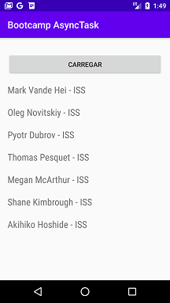

# Async Task Example
Projeto desenvolvido no curso "Trabalhando com processamento assíncrono no Android" do bootcamp everis Kotlin Developer da [Digital Innovation One](https://digitalinnovation.one).

O aplicativo faz requisições à API [http://api.open-notify.org](http://api.open-notify.org) em uma Async Task, para evitar que a Thread UI principal seja bloqueada e interrompa a interação com o usuário. Depois que a Async Task concluir o processamento em background, os dados de retorno da requisição são mostrados na Thread principal para o usuário.

## Instruções
Faça o clone ou download do repositório no seu computador e execute a aplicação no Android Studio.

## Screenshots
